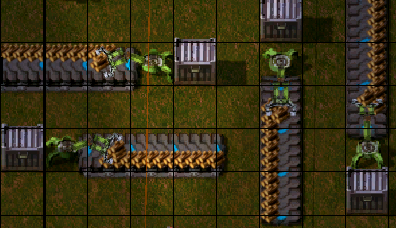
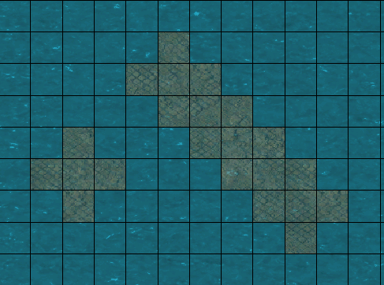

# factorio_blue_print

個人で使用するBluePrint

## メモ

## ベルト

- スループット
  - 45item/sec
  - 2700item/minute
    - Factorio Calculator で使用する値
- インサータによる搬入
  - インサータに対して右側  
      
    上下はわかりやすい(インサータから遠いほう)のに、いつも左右が思い出せない。

## 埋立地

### 線路用地の埋め立て

- 縦横は2マス幅でよい
- 斜めは、十字5マスを斜めにつなげていく感じ
- 
- 円は頑張ったけどよくわからない
  - いくつかパターンあるし調べるの面倒