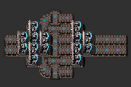
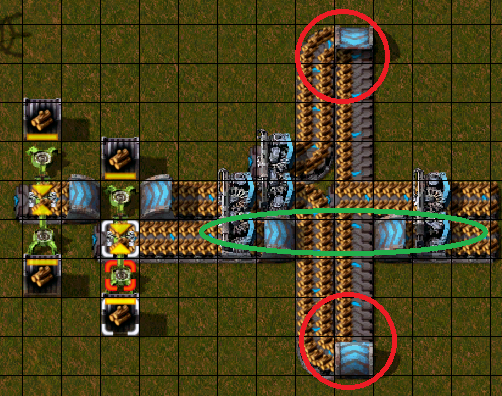
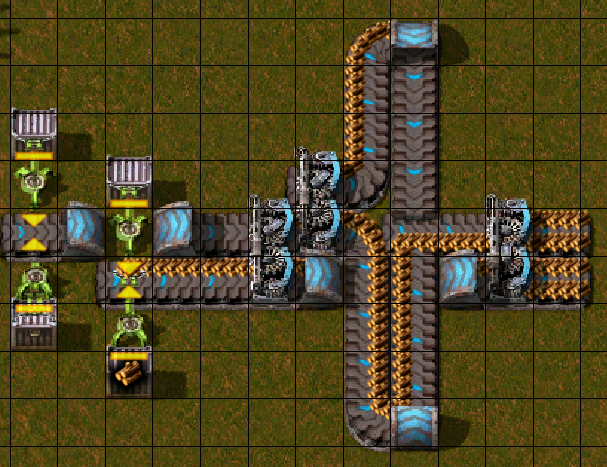
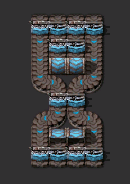
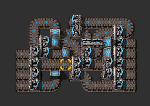
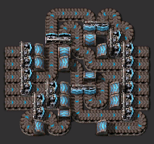

# ベルト関連

## レーンバランサー

### 1x1 レーンバランサー

特にいうことはない。  
あらゆるところに配置すべし。

### 2x2 レーンバランサー

地下ベルトを片側だけ使うタイプは、スループット減ってない？(減ってない)と気になってので、地下ベルトを使わないタイプを作った。  
というか、片側から地下ベルトを取り除いて対称にしただけ。  
対称なので、1列以上減らせると思っているが私の頭では無理。  

- 用途
  - 赤基盤その他の出力をまとめる際とか

- よくわからなかったところ  
    
    - 赤〇部分
      - 2マスから片側1レーンしかととってないじゃん！って思ったけど、そもそも分配機で1/2されているので、その後の合流を考えると問題ない。
        - 自作したものも同じ理屈だし。
    - 緑〇部分
      - インプットの入力をダイレクトに出力の分配機の入力としている。  
        レーンがある程度埋まっている場合は問題にならない。
        - ダイレクトに分配機の入力としているレーンがメインの入力となり、さらにレーンの片側の入力となった場合に、レーンバランスされなくない？と思っている。
          - そんな入力にするのが間違っている。
        - 試してみたら偏らなかった。すげえ
        - 
          - 偏ってもそれを解消するよう分配機がよろしくやってくれてる。なお分配機の片側は死ぬ模様。しかしスループットは変わらない。

## ベルトバランサー

どこかで2x3や3x2バランサーを使っていた記憶。見つかれば登録する。

### 4x4 ベルトバランサー

当工場は4青ベルトをベースにしているため、あらゆるところで見かける。  
アウトプット時も分配機を置く派。

### 4x5 ベルトバランサー

奇数のバランサーは理解をあきらめている。  
無限級数の計算とかしたくない。

- 用途  
  1青ベルトの鋼材を得る際の鉄鉱石の搬入に使用する。
  - 赤モジュールのおかげで、鉄鉱石の入力は3.5青ベルトであるのに対し、鋼材の入力として鉄板が4.2青ベルト必要なため、鉄焼き場を増やす羽目になり採用した。  

### 5x5 ベルトバランサー

一瞬で理解をあきらめたので、あっている自信がない。  
そもそも奇数分配の演算方法と分配機の対応がわかってない。

- 用途  
  1青ベルトの鋼材を得るための鉄板の搬入に使用する。