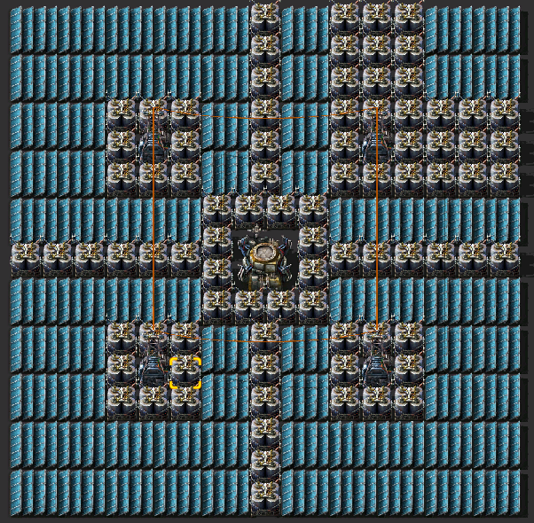
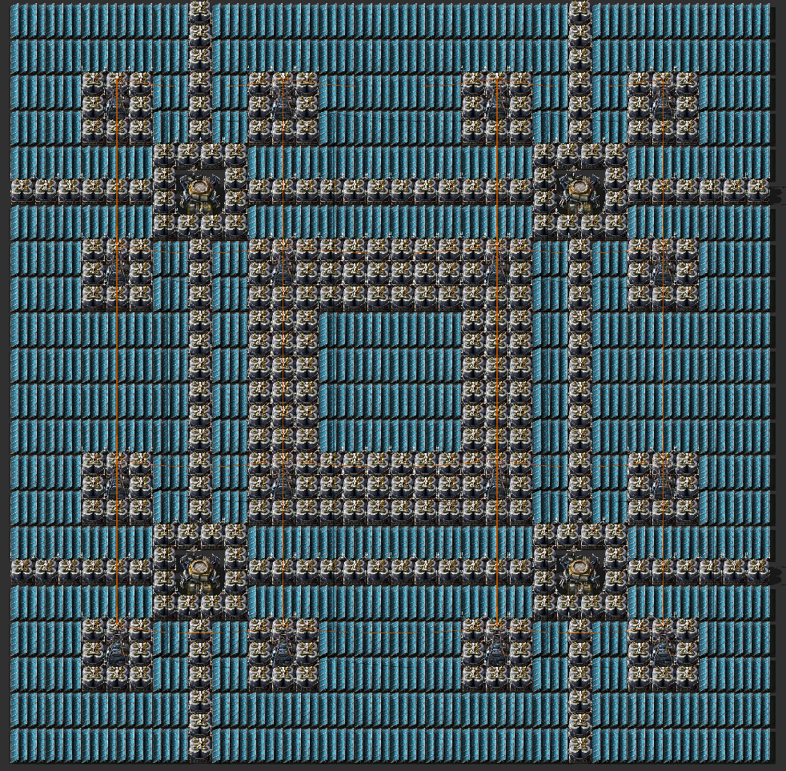
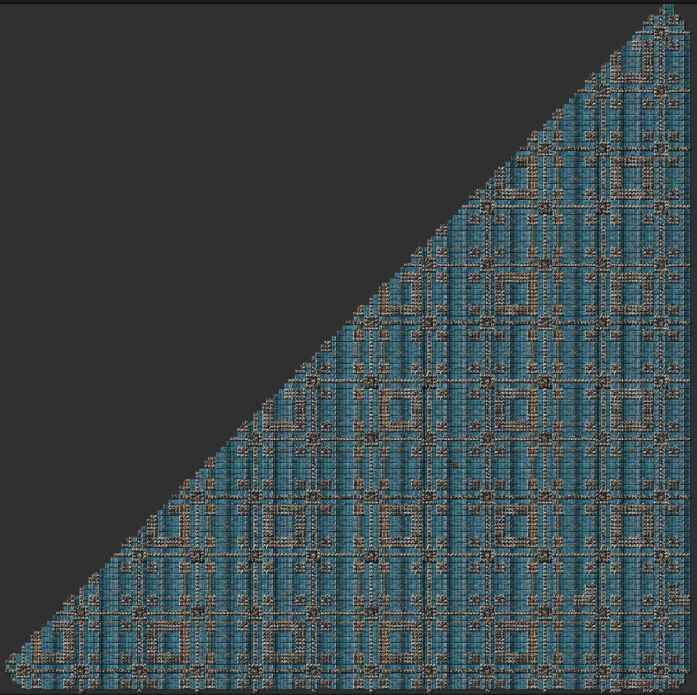
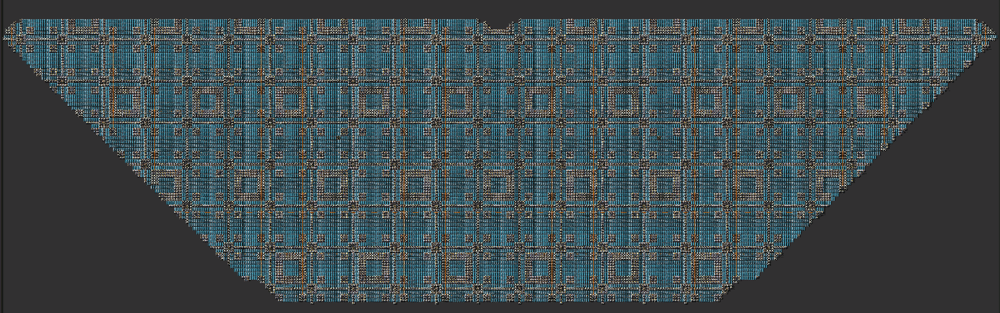

# ソーラー発電

- 1チャンクをベースにそれっぽい比にする
  - ソーラーで埋め立てる場合、1チャンク当たり2マス幅(蓄電池が入る幅)が余る。
    - あまり幅が2と3の最小公倍数になる3チャンクx3チャンクで構成するときれいになるかも
- そも電池のほうが多いので改善したほうがいい
- マップ上だと割ときれいに見える

## 1チャンク

- 構成
  | ソーラー | 蓄電池 | 広域電柱 | ロボステ | レーダー | 比率(ソーラー/蓄電池) |
  | -------- | ------ | -------- | -------- | -------- | --------------------- |
  | 72       | 86     | 4        | 1        | 0        | 0.837                 |

  

## 4チャンク

- 構成
  | ソーラー | 蓄電池 | 広域電柱 | ロボステ | レーダー | 比率(ソーラー/蓄電池) |
  | -------- | ------ | -------- | -------- | -------- | -------- |
  | 288      | 344    | 16       | 4        | 0        | 0.837                 |

  

## 大規模の斜辺部

- 構成
  | ソーラー | 蓄電池 | 広域電柱 | ロボステ | レーダー | 比率(ソーラー/蓄電池) |
  | -------- | ------ | -------- | -------- | -------- | -------- |
  | 5.2k     | 6.6k   | 322      | 78       | 1        | 0.788                 |

  

## 大規模な空きスペース

- 構成
  | ソーラー | 蓄電池 | 広域電柱 | ロボステ | レーダー | 比率(ソーラー/蓄電池) |
  | -------- | ------ | -------- | -------- | -------- | -------- |
  | 8.7k     | 10k    | 512      | 126      | 2        | 0.82                  |

  